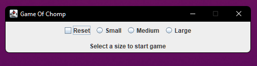
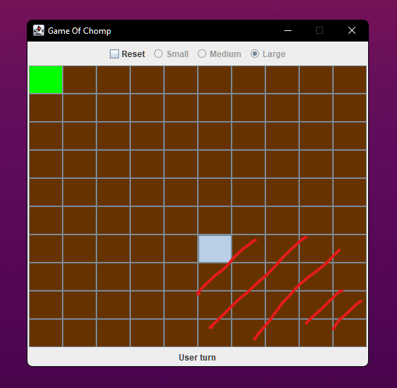
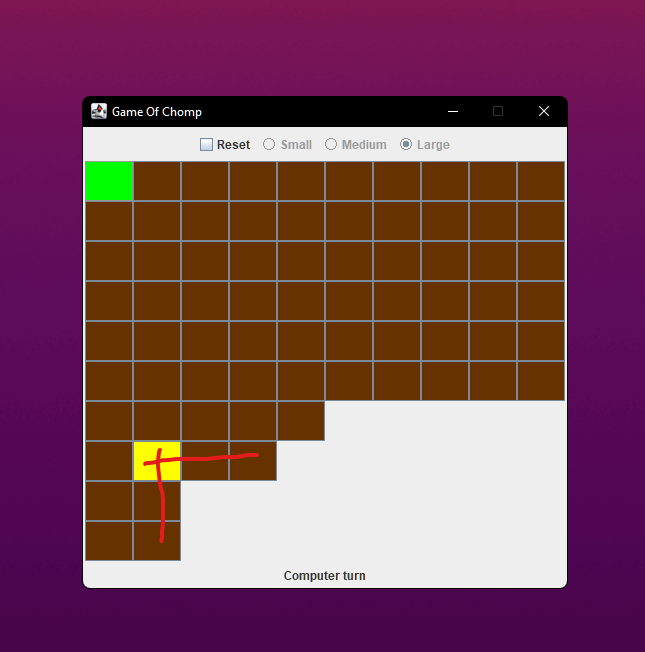
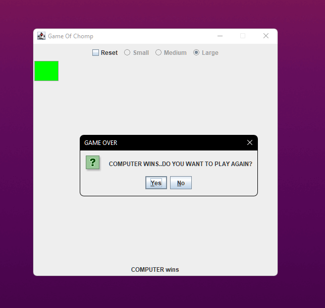

# Game Of Chomp

>**Chomp** is a two-player [strategy game](https://en.wikipedia.org/wiki/Abstract_strategy_game "Abstract strategy game") played on a rectangular grid made up of smaller [square](https://en.wikipedia.org/wiki/Square_(geometry) "Square (geometry)") cells, which can be thought of as the blocks of a chocolate bar. The players take it in turns to choose one block and "eat it" (remove from the board), together with those that are below it and to its right. The top left block is "poisoned" and the player who eats this loses.

More information about the game [here](https://en.wikipedia.org/wiki/Chomp)

Built using Java and Swing.  

## Prerequisite

- Have [JDK](https://www.oracle.com/java/technologies/downloads/#jdk17-windows) installed.
- Have [PATH system variable](https://www.java.com/en/download/help/path.html) setup.  

## Compile/Run Instructions

- Open the **src** folder.
- Open a terminal window in the **src** folder.
- Compile all files using`javac *.java`
- After compiling, run the game using `java chompGame`  

## Game Instructions  

### Selection

Select a chocolate size to start a game:

- Small (4x4)
- Medium (7x7)
- Large (10x10)

   

### Chomp Action

All squares from the bottom left corner up to the chomped (clicked) chocolate will be removed

  
 

### Computer Turn

Computer selection will be highlighted in yellow and chomped ~1 sec later.  

### Game Over

Whoever is left with the soap loses the game.  

- Clicking <u>Y</u>es will start a new game win the same size.
- Clicking <u>N</u>o will close the game.  

### Reset
To play with a different size, click on Reset and select your desired size.
